# Lab 1: The Secret Life of Passive Components - Measuring "Parasitic" Properties of Passive Components with a VNA

*Author: Arjun Dhawan*

*Lab Partner: Zachary Hoffman*

## **Abstract**
---
A Vector Network Analyzer is used to investigate and characterize the parasitic properties of passive components such as resistors, capacitors, and inductors. We compare spice simulations of these components to the actual measurements we see in lab so we better model these real life components with lumped circuit models.

## **Introduction**
---
In the study of passive components such as resistors, capacitors, and inductors, we are intially taught of their ideal behaviors. This allows us to get better intuition for circuits as a whole and understand basic circuits without the need for maxwells equations. When using these components in physical circuit however, they have *parasitic* properties. It is important to characterize these properties so we can account for them in our models.

To represent these *parasitic* properties with our conventional lumped circuit model, we add additional lumped components so the readings we see in the real world are representative of our simulations. 

The following schematics are of a realistic resistor, capacitor, and inductor represented with *lumped* circuit elements: 

- **Schematic of a Realistic Resistor**

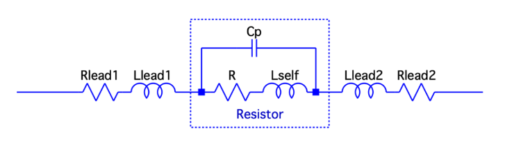

Fig.1 - Schematic of a Realistic Resistor with Lumped Circuit Elements

- **Schematic of a Realistic Capacitor**

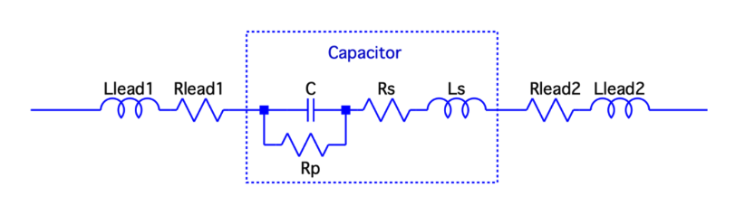

Fig.2 - Schematic of a Realistic Capacitor with Lumped Circuit Elements

- **Schematic of a Realistic Inductor**

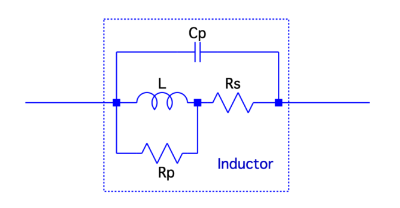

Fig.3 - Schematic of a Realistic Inductor with Lumped Circuit Elements

## **Experimental Setup**
---
To study the parasitic properties of these passive components we use a tool called a VNA (Vector Network Analyzer) to examine components in a physical setup.

At its core, a VNA allows us to measure reflectance and transmission of signals sent through a network. It does so by providing a stimulus to the network and subsequently measuring the response. The NanoVNAs we are using for this lab measures the amplitude and phase response of the system under known frequency sweeps which allow us to fully understand and characterize the Device Under Test (DUT).

Due to the exact nature of the measurements we are trying to take, we must ensure that we are only measuring the response of the DUT. Therefore, we do a calibration of the entire test setup when using a VNA in any unknown configuration. This calibration is called a SOLT (Short, Open, Load, and Through) calibration. Figures 4-5 show the measurements from the VNA in the calibration configurations once the calibration has been competed. We can see in Figure 4 that a short is represented by a point at the left of the graph, in Figure 4 that an open circuit is represented by a point at the right of the graph, and in Figure 5 that a 50 Ohm load is represented by a point at the center of the graph.

    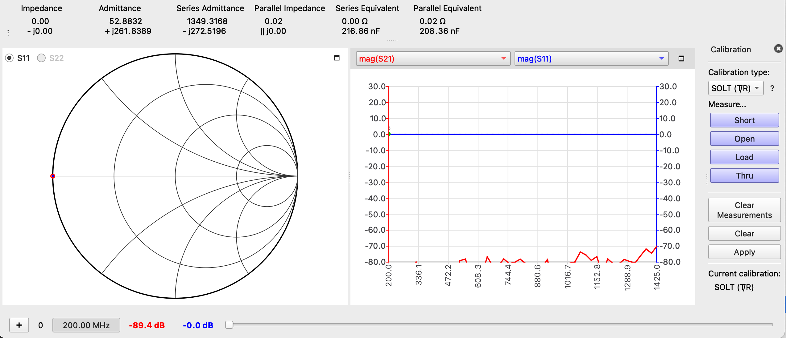
    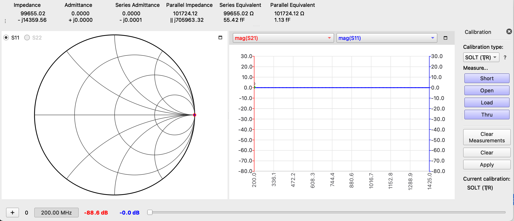
    <figcaption align="center"><b>Fig.4 - VNA Diagram of a Short on the left and an Open circuit on the right.</b></figcaption>

    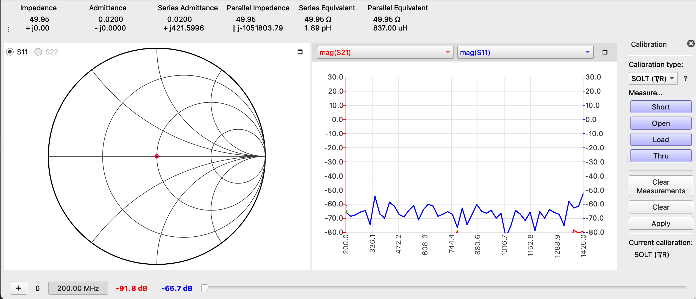
    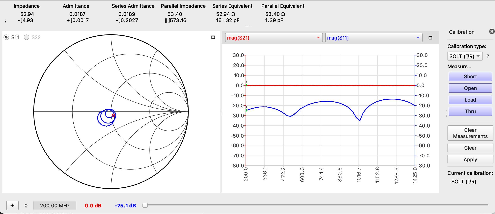
    <figcaption align="center"><b>Fig.5 - VNA Diagram of a Load on the left and a Through on the right.</b></figcaption>

## **Getting to Know the VNA**
---
Before we made any measurements to characterize the parasitic properties of any mystery elements, we began by using an RF demo board to understand how to use the VNA. The RF demo board used for this lab is shown in Figure 6. 

Fig.6 - RF Demo Board

As stated in the above section, any time the test setup changes, the VNA has to be recalibrated with a SOLT calibration. We utilized the short, open, load, and thru ports at numbers 12-16 on the RF board to calibrate the VNA for measurements with the miniature RF connectors. Once that was done, we were able to verify what we saw on the VNA with the pictures on the RF board. Figure 7. shows an example output from the capacitor on the RF board (labeled 7 in Figure 6). 

Fig.6 - RF Board Capicator Measurement through the VNA

It is very evident that the output on the VNA matched the expected output on the RF board. If we look closely, we see that the graph creeps into the inductive region of the VNA graph indicating some parasitic properties. 

## **Measurements and Results**
---
Once we were comfortable using the VNA to take measurements of components, we created mounts with copper clad and edge launch SMA connectors so we could take readings of through-hole inductors and capacitors.

To start, we simulated a Inductor and Capcitor with parasitic values in LTSpice. The goal in doing this was to set expectations for the results we would see when making measurements physically with the VNA and copper clad setup. 

    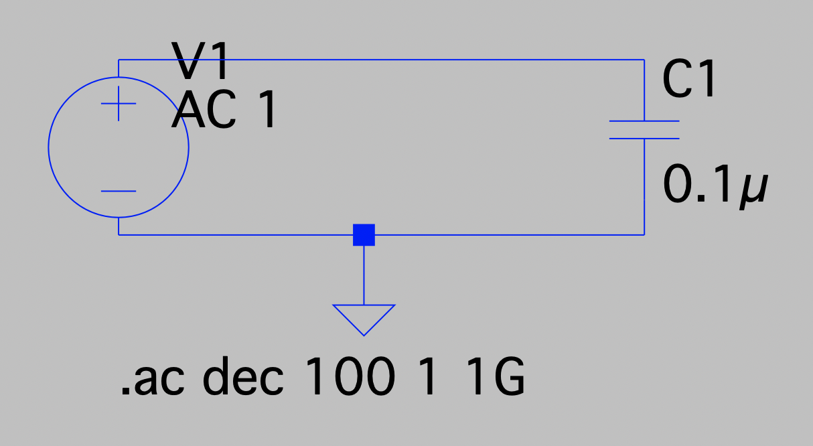
    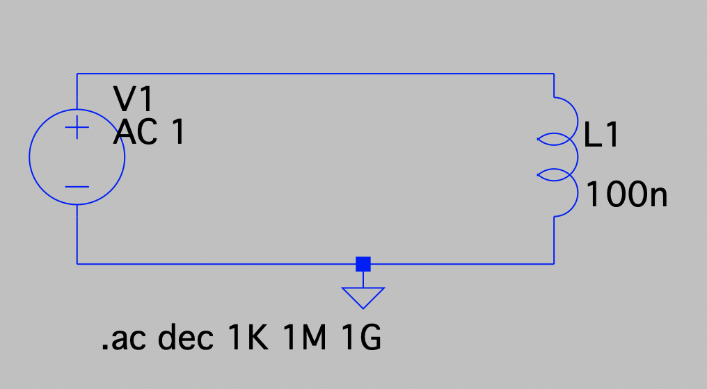
    <figcaption align="center"><b>Fig.7 - LT Spice Simulation Setup. Capacitor with parasitic values on the left. Inductor with parasitic values on the right.</b></figcaption>

Below are the results from the LT Spice Simulation compared to the physical measurement from the VNA for the inductor and capacitor. 

### Inductor

    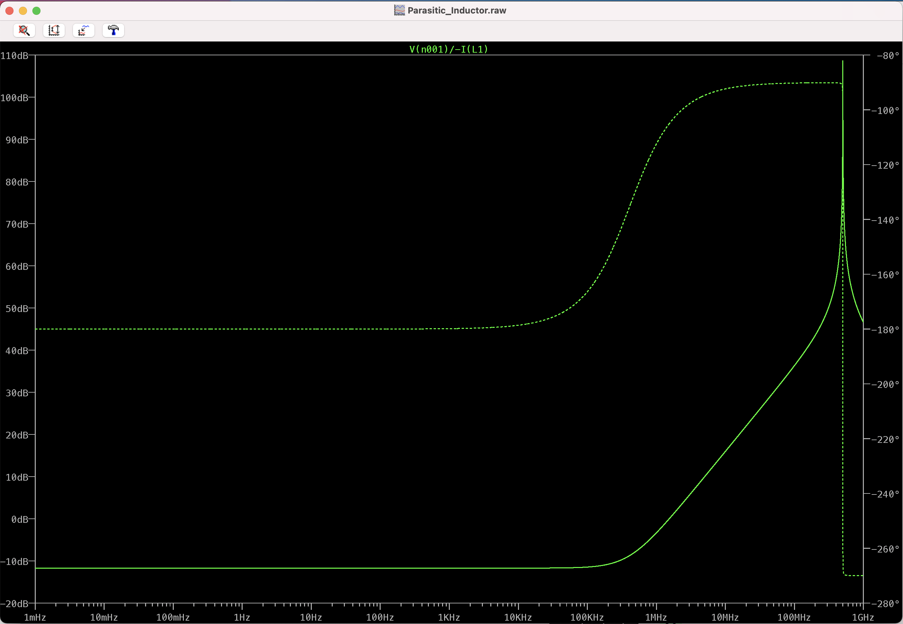
    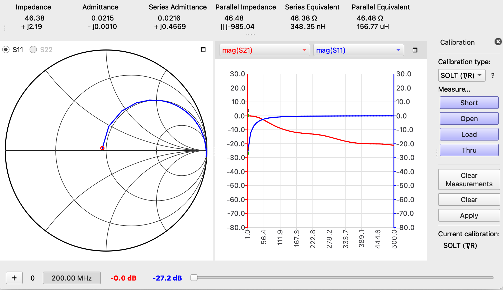
    <figcaption align="center"><b>Fig.8 - VNA measurements compared to LT Spice simulation for the Inductor.</b></figcaption>

### Capacitor

    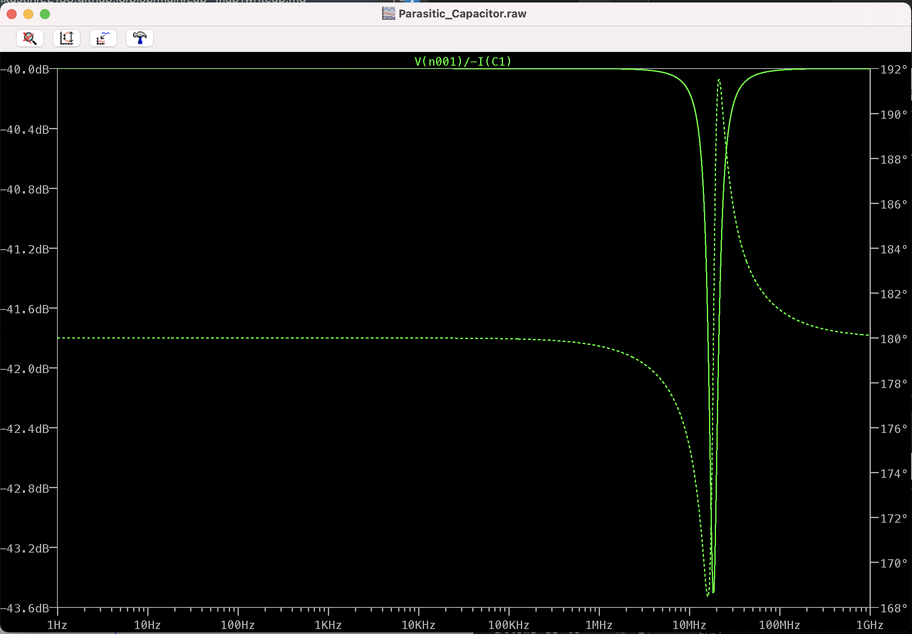
    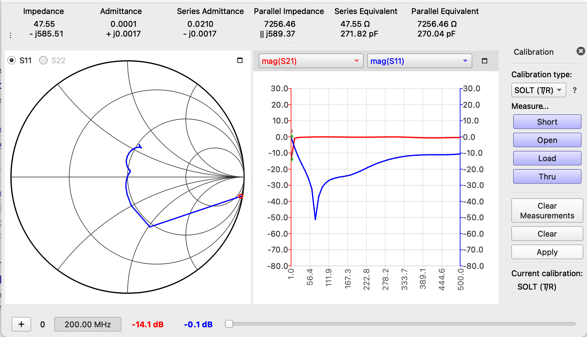
    <figcaption align="center"><b>Fig.9 - VNA measurements compared to LT Spice simulation for the Capacitor.</b></figcaption>

For the capacitor, we see a notch frequency at around 20MHz and for the inductor, we see a notch frequency at around 500MHz.

## Discussion
---
From the above VNA graphs it is very evident that passive components have parasitic properities that can be seen in their S-parameters.

Looking at the inductor and capacitor SMA and copper clad setup VNA graphs, we can see that the lines drawn by the VNA go beyond the real plane into the capacitive and inductive regions respectively. This indiciates the presence of parasitic properties. 

Additionally, when capturing the s-parameters of the mica capicator in the copper clad setup, we see a resonant frequency of about 60MHz while in the LTSpice simulation of the same setup, we see a resonant frequency of 20MHz. This is indicative of parasitic properities that if measured with the proper tools, can be fed into simulations to improve our models of physical systems. 

## Summary/Conclusions
---
In conclusion, we have learned to use a new tool (VNA) to effectively to measure the measure the response of a DUT under known stimuli. Through this lab, we have learned how to calibrate the VNAs using the SOLT method and how to display data from the VNA both on a laptop and on the VNA itself. The measurements from the VNA have enabled us to understand that passive components definitievly have parasitic properties. We have looked at simulations of passive components and have learned how to use the VNA to take measurements which improve our models of those components.
