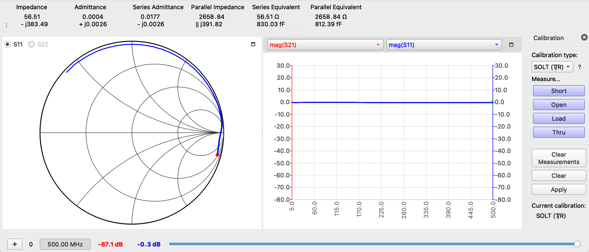

# Lab 1: The Secret Life of Passive Components - Measuring "Parasitic" Properties of Passive Components with a VNA

*Author: Arjun Dhawan*

*Lab Partner: Zachary Hoffman*

## **Abstract**
---
A Vector Network Analyzer is used to investigate and characterize the parasitic properties of passive components such as resistors, capacitors, and inductors. We compare spice simulations of these components to the actual measurements we see in lab.

## **Introduction**
---
In the study of passive components such as resistors, capacitors, and inductors, we are intially taught of their ideal behaviors. This allows us to get better intuition for circuits as a whole and understand basic circuits without the need for maxwells equations. However, when using these passive components in a real live setting, all of these components have *parasitic* properties when if not considered, can affect the performance of a circuit. 

To represent these *parasitic* properties with our conventional lumped circuit model, we add additional components so the readings we see in the real world are representative. 

The following schematics are of a realistic resistor, capacitor, and inductor represented with *lumped* circuit elements: 

- **Schematic of a Realistic Resistor**

- **Schematic of a Realistic Capacitor**

- **Schematic of a Realistic Inductor**

## **Experimental Setup**
---
To verify any measurements we take on the VNA of these components, we will first simulate the capacitor and inductor with parasitic values before we take measurements of these components on a VNA. Within LTSpice, the parasitic values are entered in the advanced settings for each of the components.

### **LTSpice Inductor Circuit**

### **LTSpice Capacitor Circuit**

### **Physical Experiment Setup**
For the physical experimental setup, a NanoVNA was used to measure the impedences on the RF board as well as of through hole components. Additionally, to ensure accurate readings, a SOLT calibration was conducted each time a cable was changed and each time the frequency range changed. This setup allowed us to measure the s-parameters of various components and get a better idea of how the VNA is a useful tool. 

## **Measurements and Results**
---
Below are the measurements and results for the lab.

### **LT Spice Results**
___
The LTSpice simulation results for the parasitic inductor and capacitor are below: 

#### **LTSpice Inductor**

#### **LTSpice Capacitor**

For the capacitor, we see a notch frequency at around 20MHz and for the inductor, we see a notch frequency at around 500MHz.

### **Copper Clad Setup Results**
___

#### **Mica Capacitor on Copper Clad Results**

#### **Inductor on Copper Clad Results**

### **RF Demo Board Results**
___
#### **SOLT Calibration**
___
The below shows the results from the SOLT calibration. As expected after calibration, a short appears as a dot on the left side of the VNA graph, an open circuit appears as a dot on the right side of the VNA graph, and the load and through appear at the center of the VNA graph. 

- **S**hort

- **O**pen

- **L**oad

- **T**hru

#### **Devices Simulated in LTSpice**
___
Below are the s-parameters for the capacitor and inductor which were simulated in LTSpice
- Capacitor

- Inductor

#### **Remaining RF Demo Board Circuits:**
___
The remaining circuits on the RF demo board are analyzed throught the VNA. As seen below, the VNA graphs are the very similar to the RF board. 
- LPF 30MHz

- HPF 100MHz

- BPF 433MHz

- BSF 6.5MHz

- 33 $\Omega$ SWR = 1.5

- 75 $\Omega$ SWR = 1.5

- Capacitor in Parallel with a device

- Capacitor in series with an inductor

- Capacitor in series with a device and inductor in parallel

- Device in paralle with an indictor and capacitor in series

- -5dB Attenuator

- -10dB Attenuator

## Discussion
---
From the above VNA graphs it is very evident that passive components have parasitic properities that can be seen in their S-parameters.

Looking at the inductor and capacitor SMD and copper clad setup VNA graphs, we can see that the lines drawn by the VNA go beyond the real plane into the capacitive and inductive regions respectively. This indiciates the presence of parasitic properties. 

Additionally, when capturing the s-parameters of the mica capicator in the copper clad setup, we see a resonant frequency of about 60MHz while in the LTSpice simulation of the same setup, we see a resonant frequency of 20MHz. This is indicative of parasitic properities that need to be characterized on a per device basis. 

## Summary/Conclusions
---
In conclusion, we have learned to use VNAs effectively to measure the s-parameters of various components. By going through this process, we have learned how to calibrate the VNAs using the SOLT method, how to display data from the VNA both on a laptop and on the VNA itself, and have been able to understand the parasitic properties of passive components. It is painfully obvious from this analysis that passive components have parasitic properties that cannot be ignored. We can simulate this fairly accurately using lumped circuit models, however, we still need to analyze physical components to understand their exact properties as depending on the experimental setup, the properties will vary. 