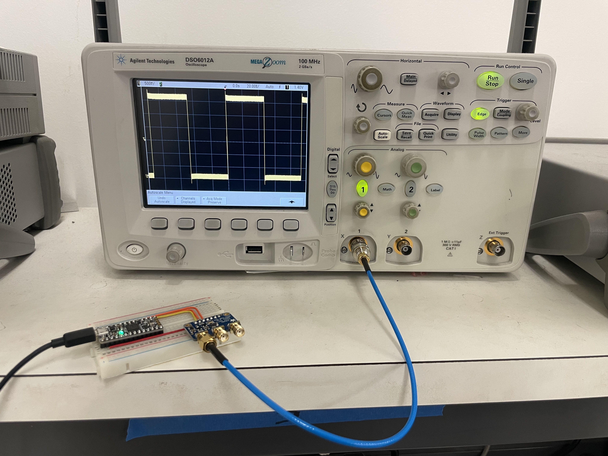
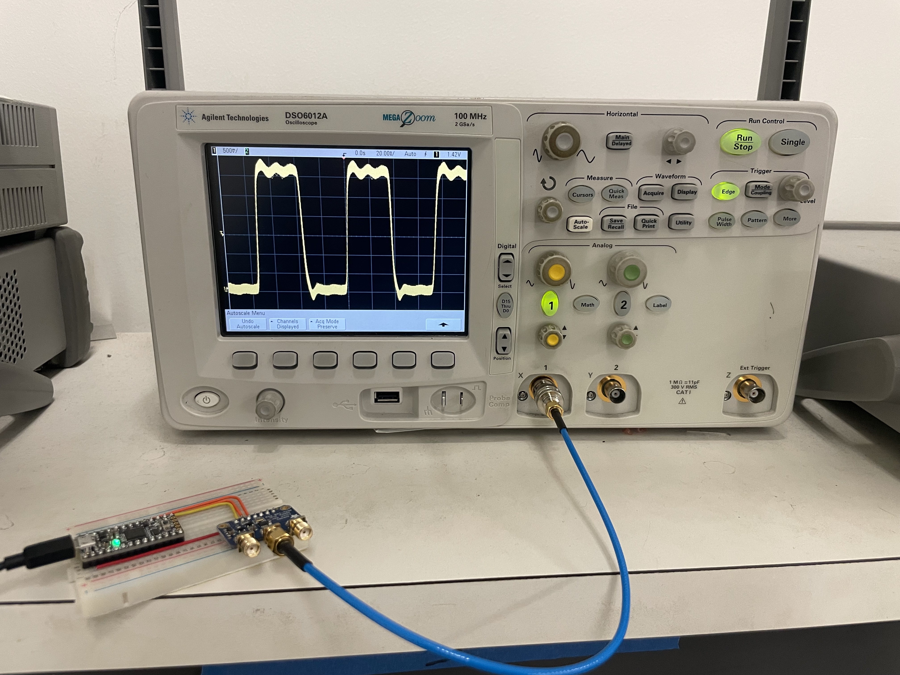
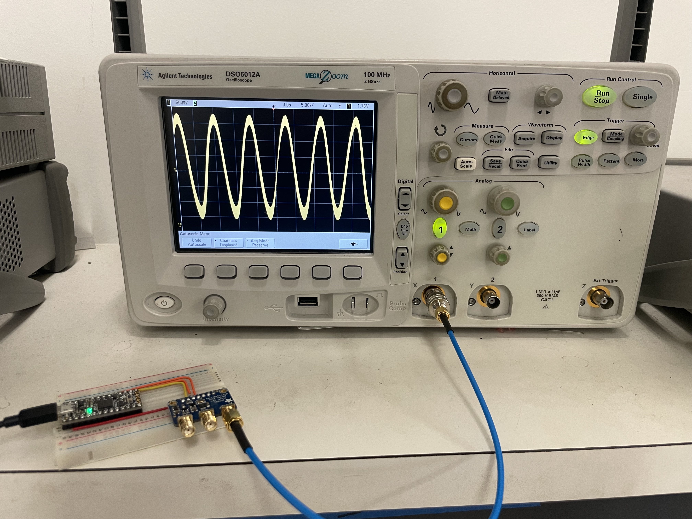
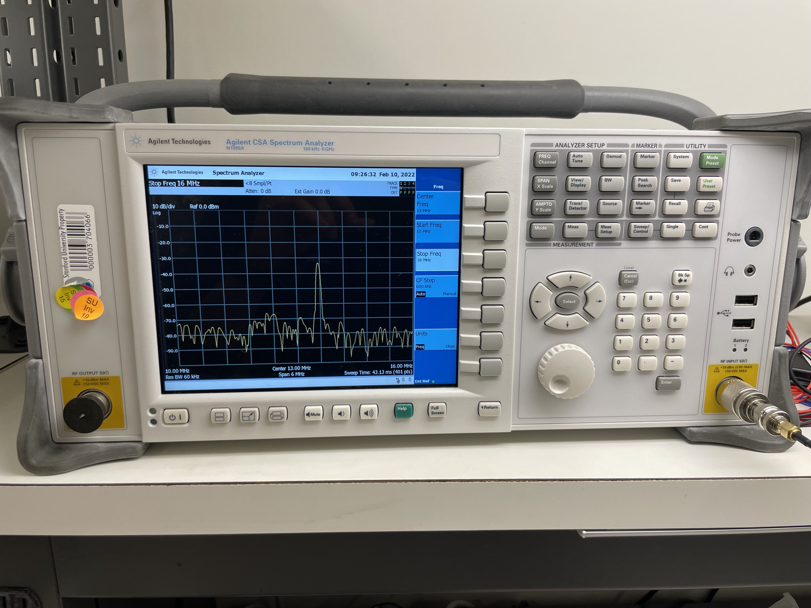
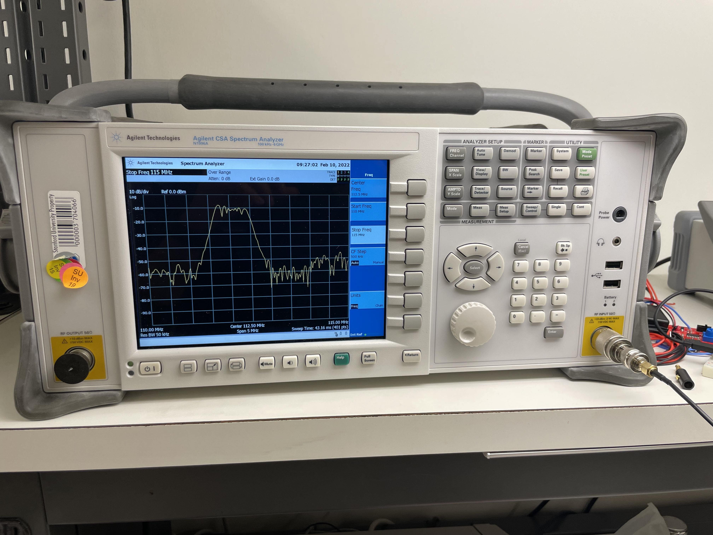

# Lab 2: Clock Generators and Circuit Python

*Author: Arjun Dhawan*

*Lab Partner: Zachary Hoffman*

## **Abstract**
---
An embedded microcontroller is programmed with Circuit Python to control a Si5351A Clock Generator breakout board. We look at the output of the clock generator on an oscilloscope and spectrum analyzer to understand its limitations and attempt to understand the potential applications of a tiny, but capable clock generator. 

## **Background**
___
As stated in the description of this lab, it is meant to be an update on the oscillator material this class previously covered. While much can be learned by building an oscillator such as a Colpitts oscillator, it is much more applicable now days to understand how to generate a clock. 

In this lab, we consider a Si5351 clock generator IC. It is a low-cost and widely used part which can be used to generate a clock signal source. Its immediate application can be seen in the NanoVNA where the Si5351 is used to generate the clock for the low frequency regime. 

We use CircuitPython on an ItsyBitsy M4 microcontroller to controll the Si5351 breakout board over I2c and look at the output on an oscilloscope and spectrum analyzer. 

## **Physical Setup**
___
The experimental setup for this lab (Fig 1) included a soderless breadboard to connect the microcontroller to the Si5351 breakout board using the i2c protocol, a SMA to SMA cable, and a SMA to BNC cable so that the output of the clock outputs could be connected to the spectrum analyzer and oscilloscope. 

Fig.1 - Experimental Setup

The hardware required for this setup are as follow:
* Adafruit Si5351 breakout boar
* ItsyBitsy M4 microcontroller
* Solderless Breadboard
* Micro USB - USB A Cable
* Jumper Wires
* 3x Edge-Launch SMA Connectors
* SMA - SMA Cable
* SMA - BNC Adapter
* Oscilloscope
* Spectrum Analyzer

## **Results**
___
In this lab we were able to use the starter CircuitPython code to control the 3 clocks on the Si5351 Breakout Board. By observing both the time and frequency domain of the clocks, we were able to get a better idea of the performance of the IC. In Figure 2, we can see the clocks output in the time domain at 10.76kHz, 13.552mHz, and 112mHz. 

    
    
    
    <figcaption align="center"><b>Fig.2 - Time Domain Output of Clocks at 10.76kHz, 13.552mHz, and 112mHz from left to right</b></figcaption>

We note that as the speed of the clock increases, we see an increased slew rate distorting the output of the clock. At 10.76 kHz we see almost a perfect square wave. As the frequency of the clock increases to 13 MHz, we start seeing some distortions in the output clock. Finally, at 112mHz, we see a clock which a very high slew rate. At this frequency, the square wave clock signal is indistinguishable. 

To verify the output of the clock in the frequency domain, we connect the clock to a spectrum analyzer. We note that the spectrum analyzer can only accurately display frequencies in the range of 100kHz to 6MHz. Therefore in Figure 3, we only display the frequency domain outputs at 13.552mHz and 112mHz. We can see these frequency domain outputs in Figure 3. The center frequencies are set to the expected frequency and we see a large peak in each image. 

    
    
    <figcaption align="center"><b>Fig.3 - Frequency Domain Output of Clocks at 13.552mHz and 112mHz from left to right</b></figcaption>

## **Discussion**
___
From the lab described above, one observation is very evident: the higher the output frequency, the larger the distortion on the output of the clock. This can present issues when other hardware is dependent on a clock with a smaller slew rate. According to the datasheet, the chip can generate clocks up to 160MHz and thus this slew rate must be attributed to the circuit and traces surrounding the chip itself. 

When investigating the IC further, it is evident that the crystal frequency it depends on is 25 MHz; however, the datasheet says the output is up to 160 MHz. This is possible due to the fractional-N PLL. By multiplying by the crystal oscillator source, we can generate output clocks higher than the frequency the crystal oscillator produces. Additionally, by using clock divider circuits, we can generate frequencies which are lower than than the crystal being used.

Next, we look at the potential uses of the Si5351. One particular application of the clock signal from the Si5351 is in generating different types of waveforms. By integrating the square clock signal, we can generate a triangle wave. Additionally,a sine wave can be generated by filtering the sine wave. These can be implemented with op amps and passive components. We can also use this IC to generate I & Q for a mixer drive. By using the same signal for two clock outputs, but setting a phase offset, we can generate the I and Q signals needed for the mixer drive. The benefit of using this chip is the I and Q signals can be modified easily in the CircuitPython code after the circuit is built. This allows for modularity and granular control in your circuits. 

## **Conclusion**
___
In modern electronics, clocks are a pervasive technology. In this lab, we have shown that low-cost clock generators are capable of generating clock signals which can be used in a wide number of applications. One of the most notable use-cases related to our class is the use of this chip in the NanoVNA. We have learned to program this clock chip using CircuitPython and have gained skills which are widely applciable to our future projects. 
