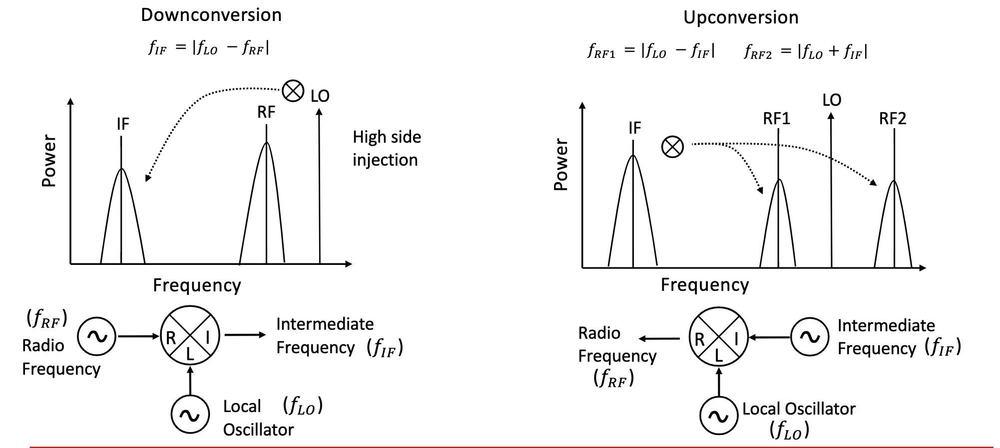
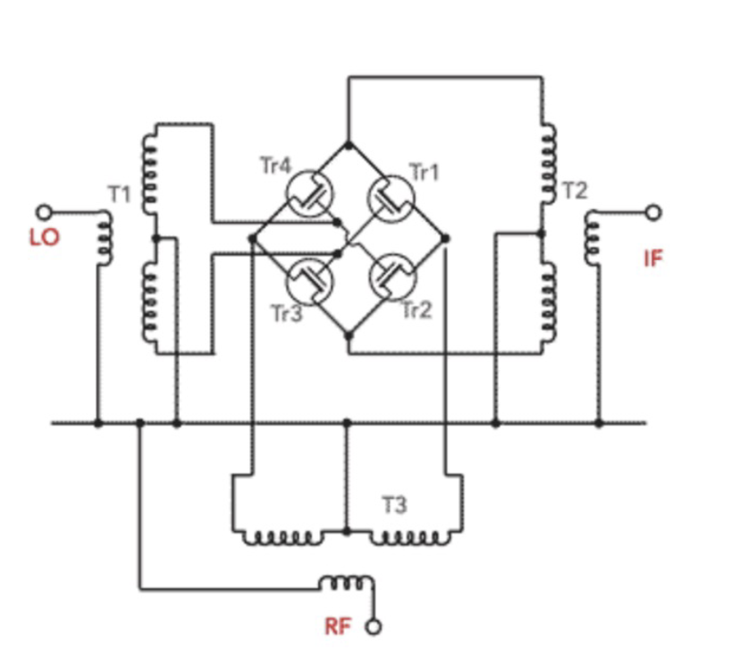
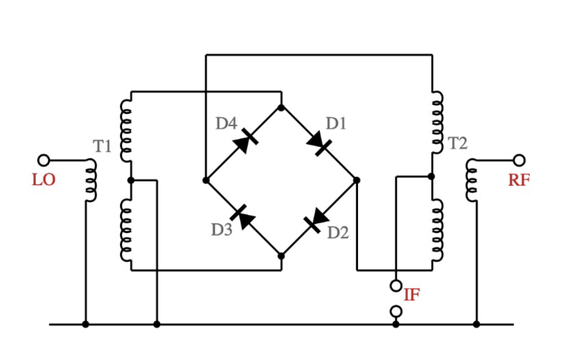
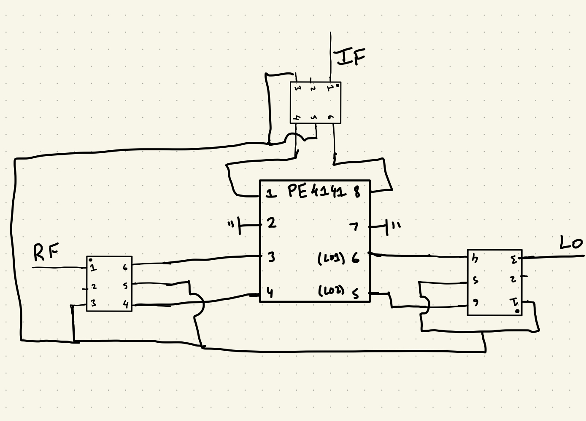
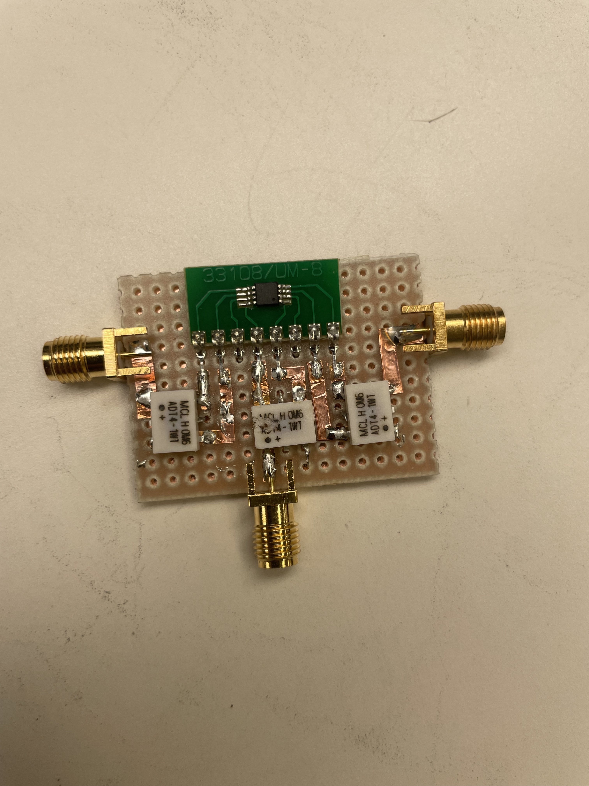
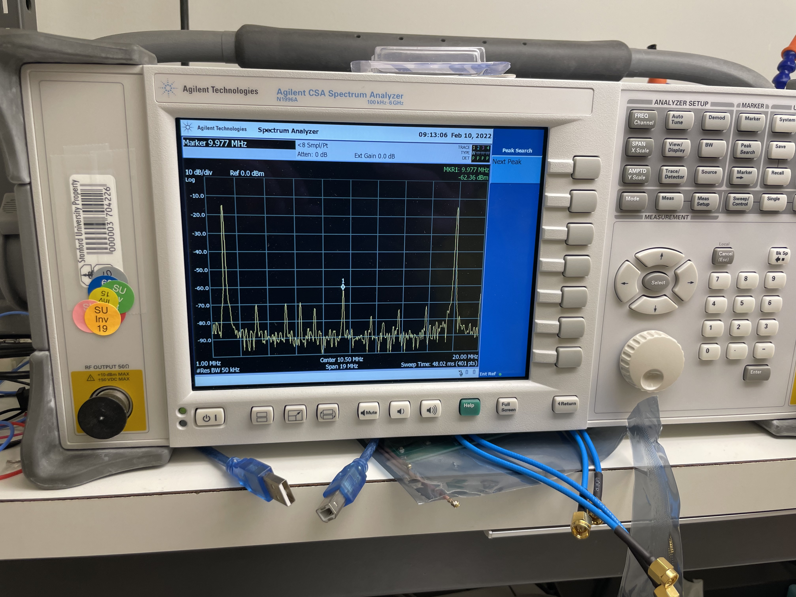
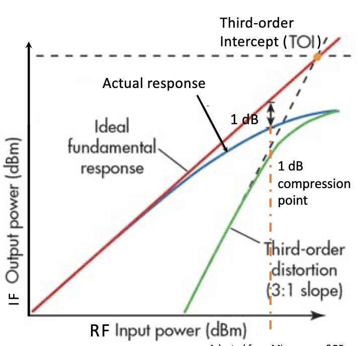
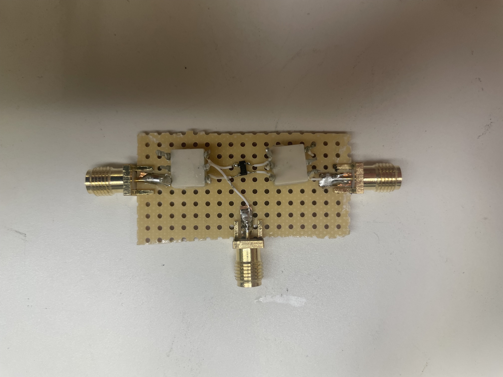
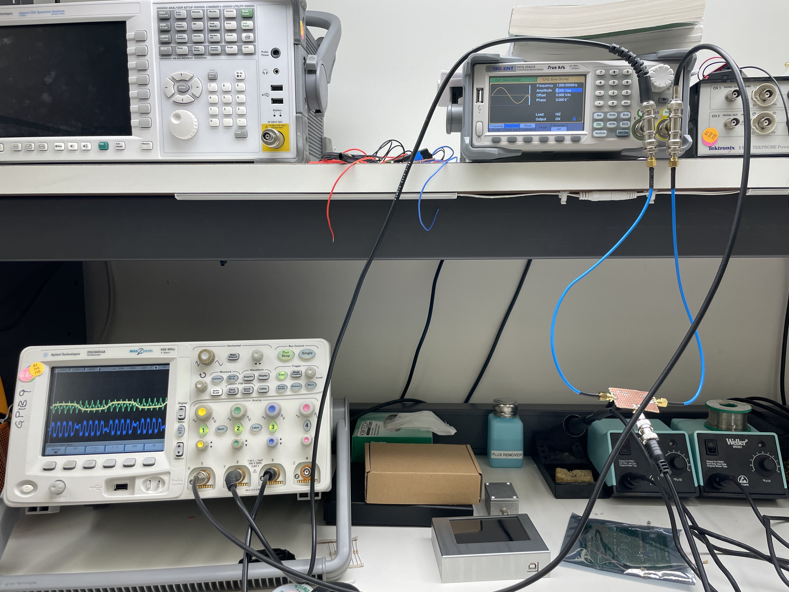

# Lab 3: FET-Ring Mixer Construction and Analysis

*Author: Arjun Dhawan*

*Lab Partner: Zachary Hoffman*

## **Abstract**
---
The purpose of a mixer is to take two input signals at different frequences and produce new signals at the sum and difference of those input frequencies.There are many types of mixers including Diode-ring mixers, FET-ring mixers, and Gilbert cells. In this lab, we construct a mixer with a FET-ring and then analyze the mixer with performance metrics. 

## **Background**
---

Functionally, mixers are meant to mix frequencies and produce new signals. Since we have three different ports we can perform downconversion and upconversion depending on the input port we use. We can see examples of downconversion and upconversion in the frequency domain in Figure 1. 

Fig.1 - Frequency domain diagram of downconversion and upconversion. 

In this lab, we construct a passive, double balanced mixer. As background, a mixer is typically has three ports: an LO port, an RF port, and an IF port. The architecture we chose for the mixer included a FET ring with three RF transformers as seen in Figure 2.

Fig.2 - Schematic of a FET Ring Mixer

An alternate architecture would have been a diode ring with two transformers as seen in Figure 3. 

Fig. 3 - Schematic of a Diode Ring Mixer

The tradeoff between these two architectures is the FET ring requires less power on the LO than the diode ring while the diode ring architecture is typically easier to match than the FET ring architecture. 

To build a FET ring mixer, we use:
- 1 PE4141 FET ring
- 3 Edge launch SMA connectors
- 1 Copper-clad pcb
- 3 ADT4-1WT+ RF Transformers
- Copper Tape

Since this was the first time we were building a board using copper clad and copper tape, we drew out the connections we would make on the board. This diagram can be seen in Fig 4. 

Fig. 4 - Diagram of FET ring mixer

## **Experimental Setup**
---

Fig. 5 - Physical construction of the FET ring mixer. 

In figure 5, we can see the constructed FET ring mixer for this lab. The left port is the LO port, the right is the RF port, and the center is the IF port. For the experimental setup, the IF port was connected to the Spectrum Analyzer while the RF and LO ports were connected to the Frequency Generator.

## **Measurements and Results**
___
Following the experimental setup, we see the following output from the IF port of the mixer on the spectrum analyzer.The RF frequency is at 8 MHz and the LO frequency is at 10 MHz. In figure 6, we see the sum and difference of these frequencies. We see a peak at 2 MHz for the difference and a peak of 18 Mhz for the sum. In addition to the sum and difference product, we see a fair amount of LO leakage at 10 MHz and some other supurious products.

Fig. 6 - IF port output on the spectrum analyzer for an RF frequency of 8 MHz and an LO frequency of 10 MHz. 

We can find the minimum IF frequency by varying the RF and LO frequencies and finding the point where the IF output is no longer a sine wave. We note that since the Spectrum analyzer cannot measure below 100kHz, we must use the oscilloscope to visually find this frequency. We start by setting the RF to 13 MHz and the LO to 12 MHz and then slowly decreasing the RF input till the IF output is no longer a sine wave. The minimum IF frequency calculated in this lab is at 30 kHz with an RF frequency at 12.03MHz and an LO frequency of 12 MHz. We can see these outputs on the frequency generator in figure 8 and the detoriated sine wave in figure 9. 

    
    
    <figcaption align="center"><b>Fig. 8 - Frequency generator output at minimum IF frequency. LO frequency on left and RF frequency on right</b></figcaption>

Fig. 9 - Deteriorated IF output sine wave

We can also use the spectrum analyzer and frequency generator to determine the 1dB compression point by comparing the RF input power to the RF output power. Ideally, they will have a 1:1 slope up until the 1dB compression point where even with an increase in RF input power, we will not see an increase in IF output power. A graph of this phenomenon can be seein in figure 7. 

Fig. 7 - Graph of 1dB compression point. 

To find this in lab, we slowly increase the RF input power on the frequency generator and find the point at which we see no increase in IF output power on the spectrum analyzer. For the FET ring mixer we constructed, the 1dB compression point was around 9dBm. 

Finally, we can calculate the conversion loss which is our IF output power -  RF input power = 16 - 9 = 7dB. 

## **Conclusions**
___
To conclude, in this lab, we have learned about a new component called a mixer which has the ability to mix input frequencies and generate the sum and differences of the input frequencies. We have learned about different architectures for these mixers and learned about the tradeoffs of each type. In this lab we focused on a FET ring mixer, however, I also built a diode ring mixer with RF transformers that could perform at much lower frequencies for AM modulation (Figure 8).

    
    
    <figcaption align="center"><b>Fig. 8 - Diode-ring mixer on left with its AM modulation output on the right. 
</b></figcaption>

We have learned about three different performance metrics for mixers: conversion loss, minimum IF frequency, and the 1dB compression point. Because of the passive architecture both the diode-ring and FET-ring utilize, we expect some conversion loss. This could be fixed with an active mixer such as a gilbert cell or by using an amplifier at the output of the IF port. The minimum IF frequency is an important metric since a minimum IF frequency of zero would allow us to have less spurious output and image frequencies we see at the IF output. In our case, we were limited by our FET-ring in terms of minimum IF frequency and saw a minimum IF frequency of 30 kHz. Finally, the 1dB compression point gives us insight into the performance of the circuit in relation to input power. By understanding this metric, we can make sure to only use an RF input which will not distort the output. 

In conclusion, we have leared about mixer architecture and essential performance metrics of mixers through this lab. 